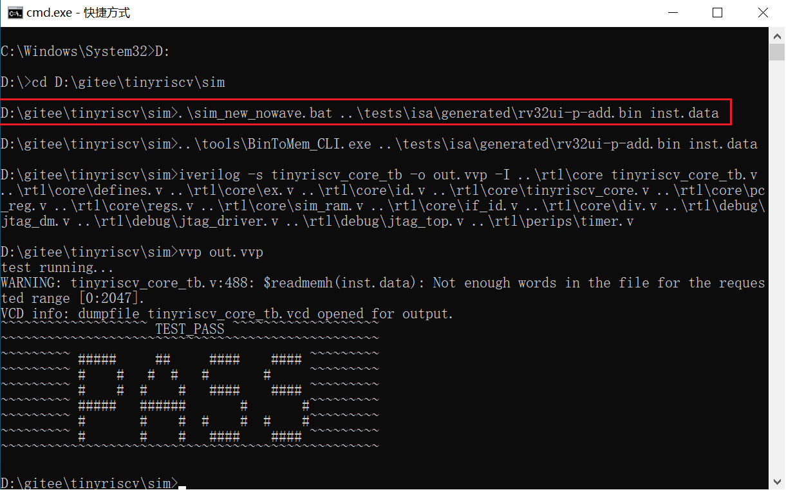
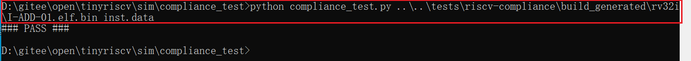

与本项目配套的设计文档[《从零开始写RISC-V处理器》](https://liangkangnan.gitee.io/2020/04/29/%E4%BB%8E%E9%9B%B6%E5%BC%80%E5%A7%8B%E5%86%99RISC-V%E5%A4%84%E7%90%86%E5%99%A8/)，目前已经更新完第三章硬件篇，开始更新软件篇。

# 1.初衷

本开源项目的初衷是本人想入门RISC-V，熟悉RISC-V的指令内容和汇编语法。

本人对RISC-V很感兴趣，很看好RISC-V的发展前景，觉得RISC-V就是CPU中的Linux。由于RISC-V是这两年才开始迅速发展的，因此关于RISC-V的学习参考资料目前还很少，特别是适合入门的资料，因此学习起来进度很缓慢，于是萌生了自己从零开始写RISC-V处理器核的想法。

本人是一名FPGA小白，为了快速入门、深入掌握RISC-V，我开始了学习FPGA和verilog的&quot;艰难&quot;历程。我工作的内容是和嵌入式软件相关的，平时根本不会接触到FPGA，也不会用到RISC-V，因此只能用业余时间来学习RISC-V。

网上有不少关于RISC-V的开源项目，但是大多都写得很&quot;高深&quot;，对于我这种小白来说学习起来是非常吃力的，不太适合入门。本项目目前的代码量非常少，是很简单易懂的，对于想入门RISC-V的同学来说是一个很好的参考，希望能够吸引更多的同学参与到RISC-V的学习中来，促进RISC-V的发展，如果能起到抛砖引玉的作用的话那就更好了，也许说是砖的话就有点夸大了，但哪怕是起到一颗沙子的作用，也就足矣。

# 2.介绍

本项目实现的是一个单核32位的小型RISC-V处理器核(tinyriscv)，采用verilog语言编写。设计目标是对标ARM Cortex-M3系列处理器。tinyriscv有以下特点：

1. 支持RV32IM指令集，通过RISC-V指令兼容性测试；
3. 采用三级流水线，即取指，译码，执行；
4. 可以运行C语言程序；
5. 支持JTAG，可以通过openocd读写内存(在线更新程序)；
6. 支持中断；
6. 支持总线；
7. 支持FreeRTOS；
8. 支持通过串口更新程序；
9. 容易移植到任何FPGA平台(如果资源足够的话)；

项目中的各目录说明：

**rtl**：该目录包含tinyriscv的所有verilog源码；

**sim**：该目录包含仿真批处理bat文件和脚本；

**tests**：该目录包含测试程序源码，其中example目录为C语言程序例程源码，isa目录为RV32指令测试源码；

**tools**：该目录包含编译汇编和C语言程序所需GNU工具链和将二进制文件转成仿真所需的mem格式文件的脚本，还有通过串口下载程序的脚本。

**pic**：存放图片；

**tb**：该目录包含仿真的testbench文件；

**fpga**：存放FPGA相关文件，比如约束文件；

tinyriscv的整体框架如下：


tinyriscv目前外挂了6个外设，每个外设的空间大小为256MB，地址空间分配如下图所示：


# 3.CoreMark测试

目前tinyriscv在Xilinx Artix-7 35T FPGA平台(时钟50MHz)上运行CoreMark跑分程序的结果如下图所示：


可知，tinyriscv的跑分成绩为2.4。

选了几款其他MCU的跑分结果如下图所示：


更多MCU的跑分结果，可以到[coremark](https://www.eembc.org/coremark/scores.php)官网查询。

# 4.如何使用

本项目可以运行在Windows和Linux平台(macOS平台理论上也是可以的)，编译仿真工具使用的是iverilog和vpp，波形查看工具使用的是gtkwave。

## 4.1Windows平台环境搭建

在使用之前需要安装以下工具：

1. 安装iverilog工具

可以在这里[http://bleyer.org/icarus/](http://bleyer.org/icarus/)下载，安装过程中记得同意把iverilog添加到环境变量中，当然也可以在安装完成后手动进行添加。安装完成后iverilog、vvp和gtkwave等工具也就安装好了。

2. 安装GNU工具链

可以通过百度网盘下载(链接: https://pan.baidu.com/s/1bYgslKxHMjtiZtIPsB2caQ 提取码: 9n3c)，或者通过微云下载[https://share.weiyun.com/5bMOsu9](https://share.weiyun.com/5bMOsu9)，下载完成后将压缩包解压到本项目的tools目录下。注意目录的层次结构，解压后的工具路径应该如下所示：

`tinyriscv\tools\gnu-mcu-eclipse-riscv-none-gcc-8.2.0-2.2-20190521-0004-win64\bin\riscv-none-embed-gcc`

3. 安装make工具

可以通过百度网盘下载(链接: https://pan.baidu.com/s/1nFaUIwv171PDXuF7TziDFg 提取码: 9ntc)，或者通过微云下载[https://share.weiyun.com/59xtmWR](https://share.weiyun.com/59xtmWR)，下载完成后直接解压，然后将make所在的路径添加到环境变量里。

4. 安装python3

到[python官网](https://www.python.org/)下载win版本的python，注意要下载python3版本的。网速慢的同学可以通过百度网盘下载(链接: https://pan.baidu.com/s/1gNC8L5dZTsN6E5TJD2rmnQ 提取码: 3b4t)，或者通过微云下载[https://share.weiyun.com/XwzSQHND](https://share.weiyun.com/XwzSQHND)。安装完后将python添加到环境变量里。

5. 下载tinyriscv代码

**使用git clone命令下载，不要使用zip方式下载**，否则有些文件会有格式问题。

`git clone https://gitee.com/liangkangnan/tinyriscv.git`

## 4.2Linux平台环境搭建

这里以Ubuntu系统为例进行说明。

1. 下载iverilog源码

`git clone https://github.com/steveicarus/iverilog.git`

2. 切换到v11分支(必须用V11或以上的版本)

`git checkout v11-branch`

3. 安装依赖

`sudo apt-get install autoconf gperf flex bison build-essential`

4. 编译、安装iverilog和vvp

```
sh autoconf.sh
./configure
make
make install
```

5. 创建python软链接

`sudo ln -s /usr/bin/python3.8 /usr/bin/python`

其中/usr/bin/python3.8对应你实际安装的python版本。

6. 安装gtkwave

`sudo apt-get install gtkwave`

7. 安装GNU工具链

可以从百度网盘下载(链接：https://pan.baidu.com/s/10uLZYf_cgtH94kZI_N6JhQ 
提取码：uk0w)或者自行下载其他版本的，下载后解压到tools目录下。

最后，需要确认tests/example/common.mk文件里的这几行内容要与你安装的工具链对应得上。


## 4.3运行指令测试程序

这里以Windows平台为例进行说明，Linux平台是类似的。

### 4.3.1 运行旧的指令测试程序

旧的指令测试程序属于比较早的指令兼容性测试方法，虽然目前RISC-V官方已经不更新了，但仍然是一个比较好的测试参考。

下面以add指令为例，说明如何运行旧的指令测试程序。

打开CMD窗口，进入到sim目录，执行以下命令：

```python .\sim_new_nowave.py ..\tests\isa\generated\rv32ui-p-add.bin inst.data```

如果运行成功的话就可以看到&quot;PASS&quot;的打印。其他指令使用方法类似。



也可以一次性对所有指令进行测试，方法如下。

打开CMD窗口进入到sim目录下，执行以下命令：

`python .\test_all_isa.py`

### 4.3.2运行新的指令测试程序

新的指令兼容性([riscv-compliance](https://github.com/riscv/riscv-compliance))测试项相对于旧的指令兼容性测试项来说对指令的测试更加严谨，可以精确到每一条指令的运行结果，而且RISC-V官方一直在更新。

下面以add指令为例，说明如何运行新的指令测试程序。

打开CMD窗口，进入到sim/compliance_test目录，执行以下命令：

`python .\compliance_test.py ..\..\tests\riscv-compliance\build_generated\rv32i\I-ADD-01.elf.bin inst.data`

如果运行成功的话就可以看到&quot;PASS&quot;的打印。其他指令使用方法类似。



## 4.4运行C语言程序

C语言程序例程位于tests\example目录里。

下面以simple程序为例进行说明。

打开CMD窗口，进入到tests\example\simple目录，执行以下命令编译：

`make`

编译成功之后，进入到sim目录，执行以下命令开始测试：

` python .\sim_new_nowave.py ..\tests\example\simple\simple.bin inst.data`

# 5.移植到FPGA

详细的移植方法请查看本项目下的fpga目录中的README.md文件。

# 6.未来计划

1. 写设计文档；
2. 优化资源和功耗(主要是译码和执行部分)；
3. 支持硬件中断嵌套和快速实时中断；
4. ......

# 7.更新记录

2020-10-25：支持Linux平台编译、仿真。新建bram分支，使用BRAM代替LUTRAM(DRAM)，节省一半以上的LUT资源，并且可以运行更大的程序。

2020-07-04：支持通过UART烧写固件；

2020-05-27：增加新的指令兼容性(riscv-compliance)测试项。

2020-05-05：支持spi master，增加spi测试例程。

2020-04-25：支持FreeRTOS(v10.3.1)。

2020-04-18：适当添加代码注释；优化中断管理模块。

2020-04-11：增加CoreMark跑分例程和跑分成绩。

2020-04-05：支持CSR指令。

2020-03-29：重大更新，主要更新如下：

1. 支持RIB(RISC-V Internal Bus)总线；
2. 优化乘法代码，节省了2/3的DSP资源；
3. 优化除法代码，解决了除法模块的BUG；
4. 完善C语言例程、启动代码和链接脚本；
5. 增加一次性对所有指令进行测试的脚本；

2020-03-08：支持中断，为此增加了timer模块来验证。

2020-03-01：支持JTAG，配合openocd可进行内存读写。JTAG文档参考[深入浅出RISC-V调试](https://liangkangnan.gitee.io/2020/03/21/深入浅出RISC-V调试/)。

2020-02-23：支持在Xilinx Artix-7平台上运行。详见[tinyriscv_vivado](https://gitee.com/liangkangnan/tinyriscv_vivado)。

2020-01-13：支持RV32M的除法指令。其C语言实现详见[div](https://gitee.com/liangkangnan/div)。

2020-01-02：支持RV32M的乘法指令。

2019-12-06：第一次发布。

# 8.其他

如有疑问或者建议，欢迎私信或者发邮件(liangkangnan@163.com)给我。

