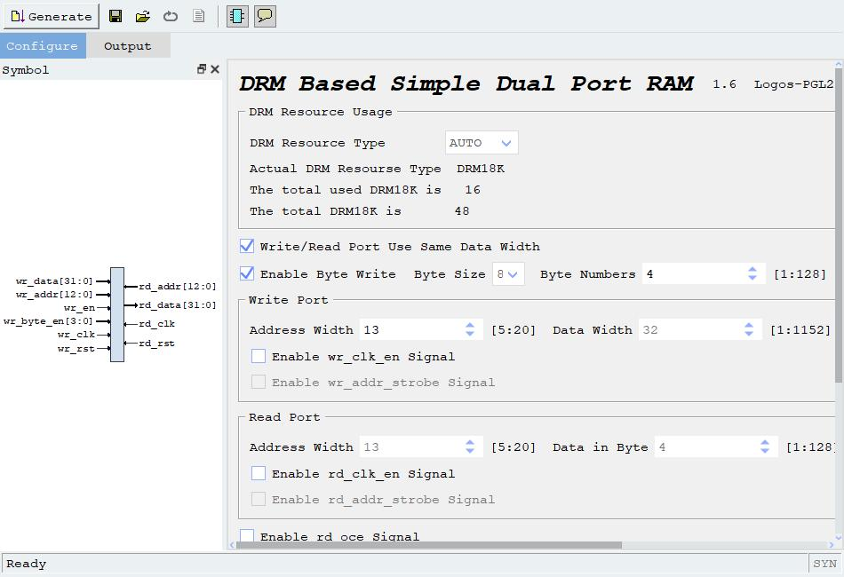
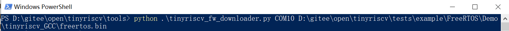

# 1.概述

在作者开发的基础上，将此项目移植到PGL22G开发板上。

1.软件：Pango Design Suite 2021.1-SP7.3-ads

2.FPGA：PGL22G。

3.调试器：CMSIS-DAP。

# 2.代码移植

在移植中，最重要的问题是存储器资源问题。考虑到PGL22G上的DRAM资源不够，无法像作者在原来代码里面一样直接使用定义reg的方式来构造存储器，必须要使用BRAM的ip核。所以我参考了BRAM分支，在这个分支的基础上，将作者所使用的BRAM改成紫光同创提供的ram的ip核`ip_dual_port_ram`来实现移植。其设置如下：



相关代码如下，首先，由于对存储单元编址的特性，可以忽略 addr 的最末尾两位。然后，原作者之前编写该模块时，对于使能用的是 we_i 和 sel_i 这两个信号。而紫光提供的 ip 核需要的是 wen 这个信号，通过对 ip 核的仿真可得知，这三者的关系为 wen = ({4{we_i}} & sel_i)。最后，通过对 ip 核的仿真还能得知， ip 核的复位是 1 生效，而作者原先的设计是 0 生效，所以还需要对复位信号做非运算。

```verilog
wire[31:0] addr = addr_i[31:2];
wire[3:0] wen;
assign wen = ({4{we_i}} & sel_i);
ip_dual_port_ram u_ip_ram(
.wr_data    ( data_i ),
.wr_addr    ( addr ),
.wr_en      ( we_i ),
.wr_clk     ( clk ),
.wr_rst     ( ~rst_n ),
.wr_byte_en ( wen ),
.rd_data    ( data_o ),
.rd_addr    ( addr ),
.rd_clk     ( clk ),
.rd_rst     ( ~rst_n )
);
```

所有工程文件，我会打包成压缩包`riscv_with_bram.rar`放到同级目录下，需要使用时解压即可。

# 3.下载程序到FPGA

## 3.1通过JTAG方式下载(对于PGL22G的移植，我只试验了这样的下载方式)

将CMSIS-DAP调试器连接好FPGA板子和PC电脑。

打开一个CMD窗口，然后cd进入到tinyriscv项目的tools/openocd目录，执行命令：

`openocd.exe -f tinyriscv.cfg`

如果执行成功的话则会如下图所示：


然后打开另一个CMD窗口，执行以下命令来连接openocd，注意电脑要启用telnet host服务。

`telnet localhost 4444`

然后在这个CMD窗口下使用load_image命令将固件下载到FPGA，这里以freertos.bin文件为例，如下所示：

`load_image D:/gitee/open/tinyriscv/tests/example/FreeRTOS/Demo/tinyriscv_GCC/freertos.bin 0x0 bin 0x0 0x1000000`

使用verify_image命令来校验是否下载成功，如下所示：

`verify_image D:/gitee/open/tinyriscv/tests/example/FreeRTOS/Demo/tinyriscv_GCC/freertos.bin 0x0`

如果下载出错的话会有提示的，没有提示则说明下载成功。

最后执行以下命令让程序跑起来：

`resume 0`

每次下载程序前记得先执行halt命令停住CPU。

`halt`

而当需要重启软件程序时，只需要用软件复位命令reset即可，无需按下开发板上对应的rst按钮，如果按下了，需要重新连接openocd。

`reset`


## 3.2通过UART方式下载

通过UART方式下载前需要先使能UART debug模块。在约束文件里指定的uart_debug_en引脚，当其输入为高电平时表示使能UART debug模块，输入为低电平时表示关闭UART debug模块。

当使能了UART debug模块后，就可以通过tools/tinyriscv_fw_downloader.py脚本来下载程序。

tinyriscv_fw_downloader.py脚本使用方法：

`python tinyriscv_fw_downloader.py 串口号 bin文件`

打开CMD窗口，进入到tools目录，比如输入以下命令：



即可下载freertos.bin程序到软核里。下载完后，先关闭UART debug模块，然后按板子上的复位(rst)按键即可让程序跑起来。
